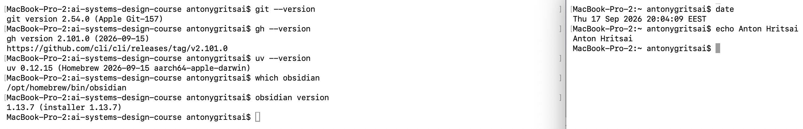
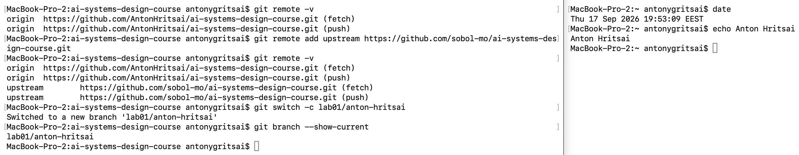
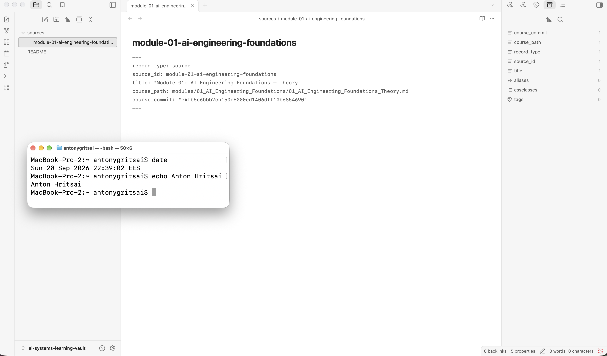
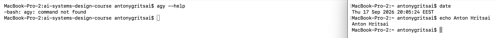
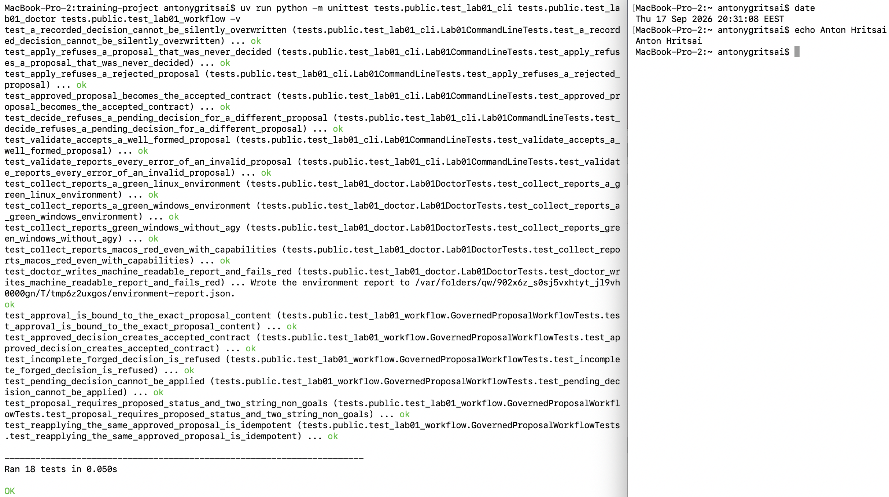
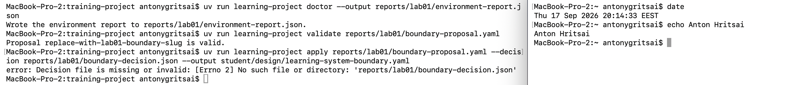
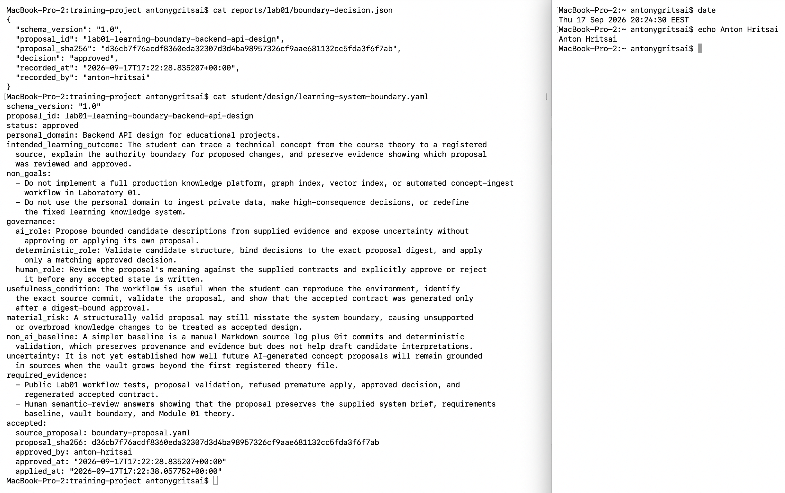

# Лабораторна робота 01

## Ідентифікація подання

- URL форку: `https://github.com/AntonHritsai/ai-systems-design-course`
- Назва гілки: `lab01/anton-hritsai`
- Повний хеш коміту після останнього merge `upstream/main`, на якому виконано фінальну
  перевірку: `9297a63fc0042d53941cd2e70a9922a5a6c1ad4a`

Роботу виконано в особистому форку репозиторію курсу. `origin` вказує на форк студента, а
`upstream` - на репозиторій викладача `sobol-mo/ai-systems-design-course`. Після оновлення
матеріалів викладача локальна гілка містить нові правила подання, оновлену перевірку
середовища та команду `learning-project prepare-report`.

## Середовище

Робоча станція - macOS/Darwin. У попередній версії лабораторної роботи такий хост був
класифікований як червоний тільки через назву ОС. Після оновлення правил хост оцінюється за
можливостями. Новий `learning-project doctor` записав `preflight: green`, тому що доступні Git,
GitHub CLI, `uv` та Obsidian. Antigravity CLI залишився недоступним, але він не входить до
обов'язкових чотирьох можливостей робочої станції; ця недоступність пояснює ручний запасний
шлях пропонувача.

Повторна перевірка версій показала незмінні Git `2.54.0`, GitHub CLI `2.101.0` та `uv 0.12.15`.
Окремий очищений журнал збережено у `reports/lab01/provision.log`, а машинозчитуваний звіт -
у `reports/lab01/environment-report.json`.

Рисунок 1 - `02-workstation-capabilities.png`

## Власність репозиторію

Клон має два віддалені репозиторії. `origin` є студентським форком
`AntonHritsai/ai-systems-design-course`, а `upstream` є публічним репозиторієм курсу
`sobol-mo/ai-systems-design-course`. Студентські результати виконуються в окремій гілці
`lab01/anton-hritsai`, а зміни надсилаються тільки до `origin`. Оновлення викладача було отримано
з `upstream/main` і злито в лабораторну гілку без конфліктів.

Рисунок 2 - `01-git-remotes.png`

## Зовнішнє сховище Markdown-файлів

Зовнішнє сховище розташовано поза Git-репозиторієм:
`/Users/antonygritsai/Desktop/Sobol/ai-systems-learning-vault`. Воно містить нейтральний
`README.md` і запис джерела `sources/module-01-ai-engineering-foundations.md`. У записі видно
`record_type: source`, `source_id`, `course_path` і `course_commit`. Значення `course_commit`
прив'язує джерело до конкретної версії теорії модуля 01, а не до фінального коміту студентської
роботи.

Сховище не входить до Git і не подається як частина репозиторію. Окрема копія поза пристроєм у
межах цієї роботи не підтверджена; це зафіксоване обмеження відновлення зовнішнього стану.

Рисунок 3 - `05-external-vault.png`

## Шлях пропонувача

Типовий пропонувач Antigravity CLI був недоступний: команда `agy` не знайдена в цьому
середовищі. Тому використано задокументований ручний запасний шлях без агента. Пропозицію
заповнено студентом у текстовому редакторі без вигаданого сеансу ШІ та без претензії, що модель
була автором кандидата.

Запланована межа повноважень не змінюється: у звичайному процесі ШІ може пропонувати кандидат,
детермінований код перевіряє структуру й застосовує лише затверджене рішення, а студент
зберігає повноваження змістовного схвалення. Ручний шлях лише замінює недоступний сеанс
пропонувача, але не надає пропозиції статусу прийнятого контракту.

Рисунок 4 - `04-manual-fallback.png`

## Семантичний розгляд

1. Так. Пропозиція зберігає надану навчальну систему знань; особиста предметна сфера є лише
   можливим пізнішим розширенням.
2. Так. Запланований результат описує спостережувану здатність студента: простежити концепт до
   джерела, пояснити межу повноважень і зберегти свідчення розгляду та затвердження.
3. Так. Нецілі виключають промислову платформу знань, графові й векторні індекси, завантаження
   приватних даних, високоризикові рішення та перевизначення ідентичності системи.
4. Так. Поля `governance` відокремлюють роль ШІ-пропонувача, детермінованого коду й людини.
5. Так. Умова корисності перевіряється через середовище, точне джерело, валідацію, відмову
   передчасного застосування, рішення та прийнятий контракт.
6. Так. Суттєвий ризик правдоподібний: структурно правильна, але змістовно надмірна пропозиція
   може бути помилково сприйнята як добрий дизайн.
7. Так. Базова лінія без ШІ простіша: ручний Markdown-журнал джерел, Git-коміти та
   детермінована валідація.
8. Так. Потрібні свідчення поєднують детерміновані результати й людський змістовний розгляд.
9. Так. Невизначеність чесно зазначає, що якість майбутнього обґрунтування пропозицій після
   розширення сховища ще не встановлена.

Висновок: пропозиція може бути схвалена після успішної детермінованої перевірки, але сама
структурна валідація не дорівнює змістовному прийняттю.

## Розподіл повноважень

У звичайній системі ШІ має право тільки пропонувати зміни. Він не може затверджувати власний
вихід і не може самостійно записувати прийнятий стан. Команда `validate` перевіряє структуру
кандидата, команда `decide` записує людське рішення з дайджестом точного вмісту, а команда
`apply` створює прийнятий контракт лише для відповідного затвердженого рішення.

На ручному запасному шляху студент написав кандидат самостійно, тому цей запуск не демонструє
живого розділення між агентом і студентом. Проте ті самі шлюзи `validate`, `decide` і `apply`
залишаються незмінними, а прийнятий стан усе одно виникає тільки після явного рішення.

## Корисність і базова лінія без ШІ

ШІ може бути корисним для чернеток обмежених інтерпретацій, зіставлення пропозиції з джерелами
та виявлення невизначеності. Простіша базова лінія без ШІ вже забезпечує походження й аудит:
Markdown-запис джерел, Git-історію, структурну валідацію та ручний семантичний розгляд. Вона
повільніша для підготовки кандидатів, але простіша, дешевша й менш залежна від зовнішнього
агентного сервісу.

## Особиста предметна сфера як пізніше розширення

Обрана сфера `Backend API design for educational projects` є не новою системою, а можливим
пізнішим навчальним розширенням. Фіксована система залишається навчальною системою знань для
технічних концептів. Запланований результат зберігає цю межу: студент має вміти простежити
концепт до зареєстрованого джерела, пояснити повноваження для змін і показати, яку пропозицію
було розглянуто та затверджено.

## Проєктний компроміс

Основний компроміс - швидкість проти контролю повноважень. Окремий семантичний розгляд і
digest-bound approval додають ручний крок, але зменшують ризик того, що грамотно сформульована,
проте необґрунтована пропозиція стане прийнятим станом системи. Відмова від графового індексу,
векторного індексу й автоматичного завантаження концептів також зменшує складність першої
лабораторної роботи.

## Детерміновані перевірки

Публічні тести після останнього оновлення матеріалів проходять повністю: `Ran 76 tests`,
`OK`. Пропозиція проходить `learning-project validate`.
Передчасне `apply` без рішення раніше завершилося помилкою, що підтверджує відокремлення
структурної коректності від затвердження. Після `decide --approve` команда `apply` створила
`student/design/learning-system-boundary.yaml` зі `status: approved`.

Успішний валідатор схеми не доводить, що пропозиція є добрим проєктом системи. Він перевіряє
наявність і форму полів, але не встановлює, чи правильна межа системи, чи достатня умова
корисності, чи обґрунтований ризик. Для цього потрібний людський змістовний розгляд.

Рисунок 5 - `03-public-tests.png`

Рисунок 6 - `06-premature-apply-refused.png`

Рисунок 7 - `07-accepted-contract.png`

## Відновлення

Відтворюване середовище відновлюється через актуальні інструкції лабораторної роботи, повторну
перевірку Git, GitHub CLI, `uv` та Obsidian і запуск `learning-project doctor`. Артефакти
проєкту відновлюються з Git-форку, гілки `lab01/anton-hritsai` і поданого коміту. Зовнішнє
Markdown-сховище не є частиною Git, тому для нього потрібне окреме резервне копіювання або
синхронізація. У цьому запуску така копія поза пристроєм не підтверджена, тому це залишається
відомим обмеженням.
