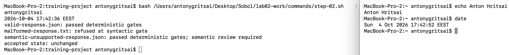
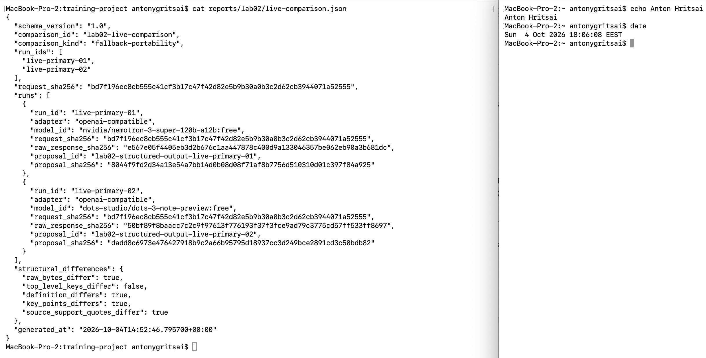
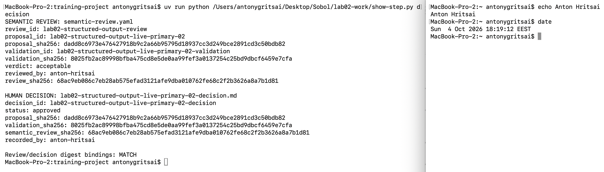
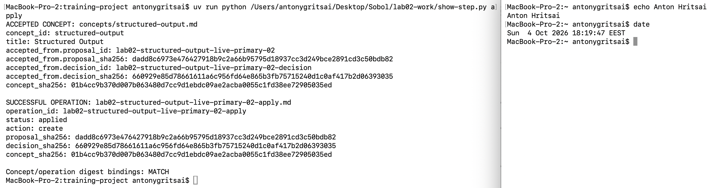
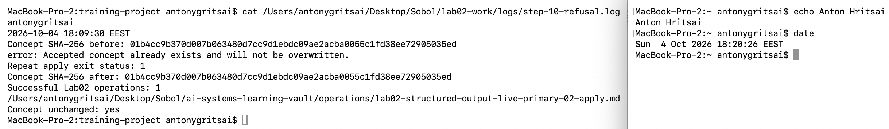
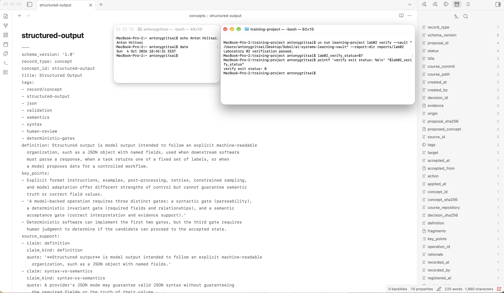

# Лабораторна робота 02

Звіт про фактичне виконання лабораторної роботи з двома живими запусками та підтвердженим прийнятим поняттям.

## Ідентифікація подання

- URL форку: `https://github.com/AntonHritsai/ai-systems-design-course`
- Назва особистої гілки: `lab02/anton-hritsai`
- Повний хеш коміту зі свідченнями: `f04877e1db8eaeb1f359890f0cecc46b9dc59466`

Стан на 2026-10-04: два живі кандидати отримано й перевірено, кандидат 02
розглянуто та явно затверджено студентом, поняття застосовано один раз і
перевірено очікувану відмову повторного застосування. Усі шість обов’язкових
скриншотів збережено й переглянуто; перевірка ланцюга проходить із кодом 0.
Текст звіту підготовлено за допомогою Codex за фактично виконаною роботою;
семантичний висновок і затвердження належать студенту.

## Початковий стан і реєстрація джерела

Спочатку активною була опублікована гілка Lab01 із чистим робочим деревом.
Її результати збережено через fast-forward main, потім злито актуальний
upstream/main без конфліктів, оновлено main особистого форку та створено
гілку lab02/anton-hritsai. Зовнішнє сховище розташоване поза клоном:
`/Users/antonygritsai/Desktop/Sobol/ai-systems-learning-vault`. Воно містило
README.md і джерело модуля 01; concepts/structured-output.md не існувало.

Команда register-source зареєструвала повний точний фрагмент §1.3 англомовної
теорії модуля 02 з ідентифікатором module-02-1-3-structured-output-controls-v1.
Базовий course_commit: `5b1a03a3b70a985bd05ac9b79b08e264c3d5d766`.
Дайджест фрагмента:
`7d7d5ce2d33d4852985c2337292fbf257ae554cefbbf7e4b9e4ef8090a797063`.
Це незмінний базовий стан джерела, а не майбутній коміт звіту. Пізніший
студентський коміт про невідстеження старої Teams-копії Lab01 не потребував
повторної реєстрації джерела і не змінював файлів upstream.

## Детерміновані шлюзи

Команда lab02 check-fixtures дала очікувані результати. valid-response.json
пройшов синтаксичний шлюз і детерміновані інваріанти. malformed-response.txt
відхилено ще на синтаксичному шлюзі, до створення пропозиції.
semantic-unsupported-response.json пройшов обидві детерміновані перевірки,
але потребує людської оцінки змісту: структурна коректність не надає
семантичного схвалення. У підсумку accepted state: unchanged.

Усі 122 публічні тести проходять. Спочатку один тест виявив, що згенерована
Teams-копія Lab01 усе ще була відстежуваною попри актуальне правило .gitignore.
Команда git rm --cached залишила файл на диску і зняла його з індексу; після
цього повний набір тестів пройшов. Файли реалізації та публічні тести не редагувалися.

Студентський скриншот фікстур перевірено та скопійовано без зміни байтів на
обов'язковий шлях screenshots/01-offline-gates.png.

Рисунок — `01-offline-gates.png`

## Живі запуски та порівняння

За допомогою prepare створено два побітово однакові запити для live-primary-01
і live-primary-02. SHA-256 кожного запиту:
`bd7f196ec8cb555c41cf3b17c47f42d82e5b9b30a0b3c2d62cb3944071a52555`.
Вони містять точний зареєстрований фрагмент і source-only/exact-quotes обмеження.

AGY на робочій станції відсутній, тому використано актуальний upstream-профіль
OpenRouter openrouter/free. Перший запит з ключем не отримав відповідь через
CERTIFICATE_VERIFY_FAILED у Python. Публічний API перевірено із системним
набором довірених CA /etc/ssl/cert.pem: HTTP 200. Для успішних запитів задано
SSL_CERT_FILE=/etc/ssl/cert.pem; TLS-перевірка залишалася ввімкненою.

Обидва живі запуски використали adapter: openai-compatible і evidence_kind: live.
Перший фактично виконав nvidia/nemotron-3-super-120b-a12b:free, другий —
dots-studio/dots-3-note-preview:free. Обидві сирі відповіді імпортовано у незмінні
пропозиції; обидва validation-result.json мають valid: true, syntactic_gate:
passed і invariant_gate: passed.

compare-live записав fallback-portability, бо моделі різні при однаковому
адаптері. Перший кандидат використовує коротке дослівне визначення; другий
додає випадки використання з першого абзацу джерела. Ключові пункти першого
описують обмеження prompt, JSON mode і constrained sampling; другий прямо
розрізняє три шлюзи та роль людини. Raw bytes, визначення, ключові пункти
й цитати відрізняються; набори полів однакові. Порівняння не приписує ці
відмінності лише випадковій вибірці, оскільки моделі різні.

Рисунок — `03-live-comparison.png`

## Семантична коректність і повноваження

Синтаксичний шлюз встановлює можливість розбору JSON. Шлюз інваріантів
перевіряє необхідні поля, значення, ідентифікатори, порядок категорій підтримки
та точність цитат. Вони не доводять, що визначення правильне або що кожна
цитата змістовно підтримує відповідну категорію. Схема на стороні постачальника
також не замінює цих інваріантів чи людської оцінки.

Модель може лише запропонувати кандидат. Уповноважений студент-рецензент
розглянув конкретного кандидата і явно підтвердив змістовний розбір перед
рішенням. Codex виконав детерміновані команди як помічник після цього
підтвердження. Окрема операція apply записала прийняте поняття лише після
approved-рішення, що ідентифікує точні байти перевіреної пропозиції.

## Семантичний розгляд і рішення

Обрано lab02-structured-output-live-primary-02, який явно описує три шлюзи
та людську роль. Дайджест пропозиції:
`dadd8c6973e476427918b9c2a66b95795d18937cc3d249bce2891cd3c50bdb82`.
Дайджест validation-result.json:
`8025fb2ac89998bfba475cd8e5de0aa99fef3a0137254c25bd9dbcf6459e7cfa`.

Студенту надано точного кандидата та відповіді на всі шість питань. Він явно
погодився з розбором і затвердив кандидата 02. Після підтвердження записано
semantic-review.yaml з reviewed_by: anton-hritsai і verdict: acceptable,
потім команда decide створила незмінне рішення зі status: approved.

Визначення і випадки використання відповідають першому абзацу джерела.
Три точні цитати підтримують definition, syntax-vs-semantics і authority-boundary;
ключові пункти відокремлюють синтаксис, інваріанти та семантичне приймання.
Людина зберігає повноваження щодо змісту; теги служать навчальній меті й не
містять полів постачальника. Correct field values у першому пункті тлумачиться
як змістова правильність, оскільки наступний пункт прямо зберігає детерміновану
перевірку полів і зв'язків. source_support.claim є короткими мітками категорій;
їхній зміст підтверджують відповідні точні цитати. Зовнішніх фактів чи нового
непідтримуваного значення не виявлено.

Дайджест підтвердженого розгляду:
`68ac9eb086c7eb28ab575efad3121afe9dba010762fe68c2f2b3626a8a7b1d81`.
Рішення прив'язує той самий proposal_sha256, точну перевірку та цей розгляд.

Рисунок — `04-review-decision.png`

## Прив’язки SHA-256

Дайджест файлу джерела зв'язує точний запис походження, а fragment_sha256 —
точний фрагмент §1.3. Model request вбудовує фрагмент та його дайджест.
Метадані запуску й evidence пропозиції зв'язують request_sha256,
raw_response_sha256, source_id, fragment_id і дайджест джерела.
Validation прив'язує proposal_id та точні байти пропозиції.

Семантичний розгляд прив'язує пропозицію і validation-result. Рішення прив'язує
точні дайджести пропозиції, перевірки та розгляду. Accepted_from у понятті й
запис операції з'єднують пропозицію та рішення з точними байтами прийнятого
стану. Дайджест рішення:
`660929e85d78661611a6c956fd64e865b3fb75715240d1c0af417b2d06393035`.
Дайджест прийнятого поняття:
`01b4cc9b370d007b063480d7cc9d1ebdc09ae2acba0055c1fd38ee72905035ed`.

SHA-256 виявляє заміну байтів між етапами. Він не доводить семантичну правильність,
чесність задекларованого авторства або криптографічне виконання виведення
зовнішньою моделлю. Метадані запусків прямо фіксують це обмеження атрибуції.

## Контрольоване застосування

Після людського підтвердження, acceptable review і approved decision команда
apply успішно створила зовнішній concepts/structured-output.md та один запис
operations/lab02-structured-output-live-primary-02-apply.md зі status: applied
і action: create. Прийняте поняття походить від другого живого запуску й
містить accepted_from з точними proposal_id, decision_id та їхніми дайджестами.

Структурна перевірка сама не дозволила запис: потрібні були відповідні
семантичний розгляд і рішення. Запис операції додатково прив'язує дайджест
створеного поняття. Перевірено збіг прив'язок поняття, рішення й операції.

Рисунок — `05-controlled-apply.png`

## Відмова без зміни прийнятого стану

Ту саму команду apply виконано повторно після першого успішного застосування.
Вона відмовила з повідомленням Accepted concept already exists and will not
be overwritten та кодом завершення 1. Стан не перезаписано; успішних записів
операції Lab02 залишилося рівно один.

SHA-256 concepts/structured-output.md до і після відмови однаковий:
`01b4cc9b370d007b063480d7cc9d1ebdc09ae2acba0055c1fd38ee72905035ed`.
Зовнішній скрипт step-10.sh перевірив цей збіг, код відмови та кількість операцій
і сам завершився успішно. Код 0 скрипта означає успішну перевірку очікуваної
відмови; він не означає успіх другого apply. Контрольний скриншот
02-refusal-unchanged.png показує саме цей етап і підтвердження незмінності.

Рисунок — `02-refusal-unchanged.png`

## Проєктний компроміс

OpenRouter free router дав дві живі відповіді без придбання окремого доступу
до платного профілю, але обрав різні моделі. Це дозволяє перевірити портативність
схеми та обмеженого запиту, проте не дозволяє трактувати всі відмінності як
мінливість однієї моделі. Не витрачали третю генерацію лише для примусової
однаковості моделей чи відмінності текстів. Детерміновані перевірки та людський
розгляд додають час, зате відділяють дешеве отримання кандидата від повноважень
змінювати прийняте знання.

## Захист облікових і платіжних даних

Ключ студента був підготовлений поза репозиторієм у тимчасовому файлі з правами
0600. Він не друкувався у чаті чи командах і передавався CLI лише через змінну
середовища OPENROUTER_API_KEY. Shell tracing не вмикався. Після другої успішної
генерації змінну очищено, тимчасовий файл видалено; ключ відсутній у метаданих
і артефактах Git. TLS налаштовано через системний набір CA без вимкнення перевірки.

Чи вимагав OpenRouter перевірки картки саме в обліковому записі студента — ще
не підтверджено студентом. Дані картки не збиралися й до звіту не включалися.

## Канонічний, аудиторський і похідний стан

Канонічне прийняте знання міститься у зовнішньому concepts/structured-output.md.
Аудиторські свідчення — зареєстроване джерело, request/raw response/run metadata,
незмінні пропозиції, підтверджений розгляд, рішення й запис операції.
Validation, live-comparison, verification-report і згенерована Teams-копія
є похідними результатами. Похідність не дозволяє змінювати вже зв'язані
байти посеред поточного ланцюга; відбудова потребує збереження узгодженості
прив'язок або нового керованого запуску.

У Git додаються лише студентські reports/ і student/. Повний vault не додається.
Згенерований reports/lab02/submission/REPORT.md після prepare-report залишатиметься
локальним ігнорованим файлом для безпосереднього завантаження в Teams.

## Остаточна перевірка

Останній повний запуск public suite: Ran 122 tests, OK, exit 0.
Керований ланцюг до прийнятого поняття створено; семантичний розгляд і рішення
підтверджені людиною, контрольована операція успішна, повторне застосування
відхилено без зміни байтів. Lab02 verify повідомляє status: passed: усі
10 перевірок пройдено, карта артефактів непорожня, код завершення 0.
Фінальний скриншот показує прийняте поняття в Obsidian поруч з успішною
перевіркою, ім’ям студента й системною датою. Після збереження його остаточних
байтів перевірку повторено, щоб зафіксувати їхній актуальний SHA-256.

Фінальний verify підтверджує внутрішню узгодженість ланцюга та артефактів,
а не самостійно оцінити їхню семантичну правильність чи авторство зовнішньої моделі.

Рисунок — `06-final-result.png`
